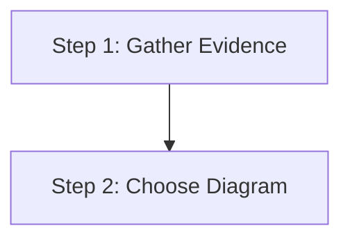
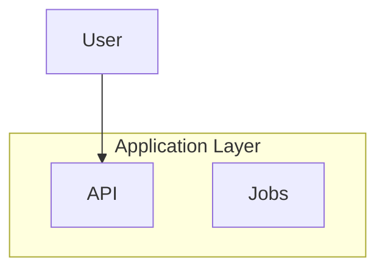
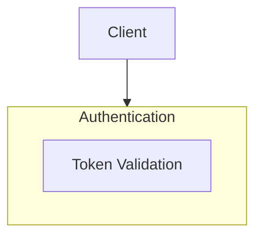

Use this reference when authoring or reviewing Mermaid syntax and renderer compatibility matters.

## High-signal safety rules

- Keep labels short and plain. Prefer concise nouns, verbs, or short phrases over full sentences.
- Avoid `1. Text` patterns inside node labels because some renderers interpret them as markdown lists. Prefer `1.Text`, `Step 1`, or `(1)`.
- Prefer stable IDs with display labels when naming subgraphs or reusable nodes.
- Reference nodes and subgraphs by ID, not by display text.
- Avoid emoji in labels because they reduce portability and can affect layout.
- Avoid punctuation-heavy labels when simpler text works. Extra punctuation often hurts readability and can trigger parsing edge cases.
- Prefer quotes only when needed for spaces or special text. If simpler wording works, use simpler wording.
- Prefer common Mermaid syntax that renders well in GitHub-, Obsidian-, and markdown-oriented environments.

## Safe patterns

### Numbered labels

### Subgraph IDs with display labels

### Referencing IDs instead of display text

## Compatibility guidance

- Prefer simple arrows, labels, and layout declarations before using advanced constructs.
- Avoid relying on renderer-specific features unless the target environment is known.
- If readability depends on styling, revise the structure or labels first.
- If a label needs escaping or heavy punctuation to work, consider renaming it instead.

## Review checks

- Labels are concise and unlikely to trigger markdown parsing edge cases.
- Subgraphs and reusable nodes use stable IDs.
- References use IDs rather than display labels.
- The diagram avoids unnecessary special characters, emoji, and syntax-heavy text.
- The diagram should render in common markdown Mermaid viewers without feature assumptions.

## Gotchas

- If labels read like prose paragraphs, the diagram becomes hard to scan even when it still renders.
- If numbering looks like markdown list syntax, some viewers break the diagram unexpectedly.
- If subgraphs are referenced by display text instead of IDs, later edits become fragile.
- If styling carries meaning that labels do not, portability drops because some renderers ignore or simplify styling.
